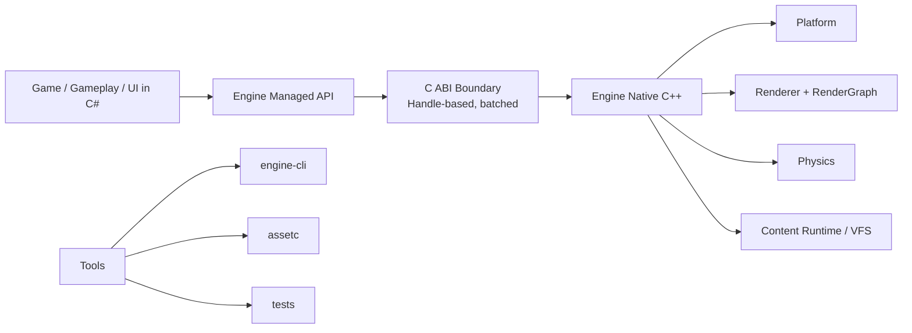
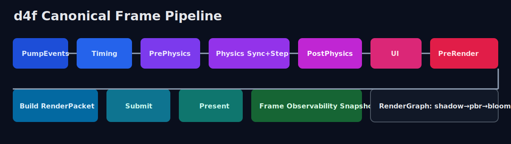

# diesel-for-free (d4f)

`diesel-for-free` is a data-oriented game engine architecture:

- Full name: `diesel-for-free`
- Public short name: `d4f`
- Internal code prefix: `dff`

The project is built around a strict managed/native split:

- Gameplay, ECS orchestration, UI composition and app loop in C#
- Rendering, physics, platform and content runtime in C++
- A coarse C ABI boundary with handle-based APIs and frame-batched interop


## Tech Stack


## Visual Architecture



## What Is Implemented

- Canonical frame graph pipeline in native renderer
- Post stack: `bloom -> tonemap -> color_grading` chain
- Handle-based resource model and C ABI versioning
- Physics sync/step/query bridge (raycast, sweep, overlap)
- Offline asset pipeline with compiled manifest and pak workflow
- Runtime content VFS: mount pak and development directories
- Packaging flow with `engine-cli pack` and portable output layout
- Frame observability: CPU stage timings + renderer frame stats

## Repository Layout

```text
engine/
  native/         # C++ runtime, bridge_capi, render, physics, content
  managed/        # C# APIs (App, ECS, Rendering, UI, Physics, NativeBindings)
  tools/          # engine-cli, assetc, shared asset-pipeline
samples/          # usage samples
templates/        # game-template used by engine-cli init
```

## Quick Start

### Prerequisites

- .NET SDK 9
- CMake 3.20+
- C++20 toolchain (MSVC/Clang/GCC)

### First Native Configure (fresh clone)

```bash
cmake -S engine/native -B engine/native/build
```

or use helper script:

```bat
build-native.bat
```

By default, helper `.bat` scripts keep the window open at the end.
Use `--no-pause` when running from an existing terminal.

### 1. Initialize a Game Project

```bash
dotnet run --project engine/tools/engine-cli -- init --name MyGame --output .
```

or create a standalone game repository directly:

```bat
create-game-repo.bat MyGame
```

Generated project includes a runtime bootstrap at:

`MyGame/src/MyGame.Runtime/MyGame.Runtime.csproj`

### 2. Build Game Stubs

```bash
dotnet run --project engine/tools/engine-cli -- build --project MyGame --configuration Debug
```

### 3. Build and Pack Content

```bash
dotnet run --project engine/tools/engine-cli -- pack \
  --project MyGame \
  --manifest assets/manifest.json \
  --output dist/content.pak \
  --runtime win-x64 \
  --configuration Release \
  --zip dist/MyGame.zip
```

`pack` produces:

- `dist/content.pak`
- `dist/compiled.manifest.bin`
- `dist/compiled/*`
- `dist/package/App/*`
- `dist/package/Content/Game.pak`
- `dist/package/Content/compiled.manifest.bin`
- `dist/package/config/runtime.json`
- optional `dist/MyGame.zip`

### 4. Run Build Stub

```bash
dotnet run --project engine/tools/engine-cli -- run --project MyGame --configuration Debug
```

## Standalone Asset Compiler

Build pak from source manifest:

```bash
dotnet run --project engine/tools/assetc -- build --manifest MyGame/assets/manifest.json --output MyGame/dist/content.pak
```

List pak entries:

```bash
dotnet run --project engine/tools/assetc -- list --pak MyGame/dist/content.pak
```

## Core Principles

These are non-negotiable architecture guardrails in d4f:

- One canonical way for each major operation
- Coarse managed/native calls per frame, not per draw
- Handle-based APIs, no raw pointer leakage
- RenderGraph as mandatory frame backbone
- Offline asset pipeline only
- Versioning of ABI, assets and scene formats
- Built-in observability for frame diagnostics

## Frame Pipeline



## LLM Documentation

For autonomous coding agents and assistants, use:

`LLM_ENGINE_GUIDE.md`

This file contains:

- architecture invariants
- golden-path implementation patterns
- do/don't lists
- extension checklists for render/physics/assets/ui/interop

## GitHub Integration

- CI workflow: `.github/workflows/ci.yml`
- Contribution guide: `CONTRIBUTING.md`
- Issue templates: `.github/ISSUE_TEMPLATE/*`
- PR template: `.github/PULL_REQUEST_TEMPLATE.md`
- Code of conduct: `CODE_OF_CONDUCT.md`
- Security policy: `SECURITY.md`

## License

BSD0
